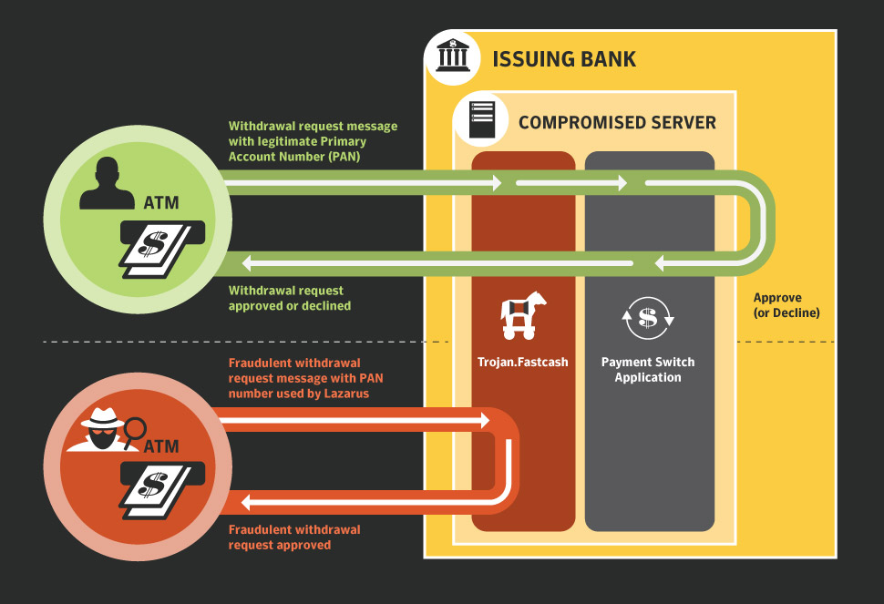

⚠️ ⚠️ ⚠️ We condemn any attempt to apply these mechanics, this repository was created for educational purposes for security research.
# How does it work?

The presented scheme illustrates the mechanism of an attack on a banks processing system using the Fastcash malware. Attackers exploit compromised servers to intercept and manipulate financial transactions.

The attack begins with the initiation of a fraudulent cash withdrawal request through ATMs using stolen card data (PAN). The malware, implanted in the bank’s processing system, intercepts the request and modifies it, generating a fake approval message for the transaction.

As a result, the payment application processes fraudulent requests as legitimate, allowing attackers to withdraw cash while bypassing standard validation mechanisms. During the attack, a false transaction authorization is generated, enabling the attackers to siphon money from ATMs without actually debiting the target account.

The primary objective of such an attack is to compromise the payment gateway and circumvent the monitoring and security systems of the processing center. The malware effectively disguises fraudulent transactions as legitimate, making timely detection challenging.

# Project structure
1. config: 
Contains configuration files and auxiliary utilities.
	- blk.dat: List of locked transactions in key-value format.
	- decryptJackpot.cpp: Utility to decrypt the created jackpot logs.
	- encrypt.cpp: Utility for encrypting used configuration data.
	- info.dat: List of PAN (Primary Account Number) numbers in key-value format.
	- info.ini: Configuration file containing data from info.dat and blk.dat, defining key operational parameters.

2. injector: 
This directory contains injector code for the AIX/Linux and Windows platforms.
	- inAIX:
	- injectorAIX.cpp: An injector for AIX-based systems responsible for injecting XCOFF (shared object) into the target process.
	- makefile: A script to build the injector for AIX.
	- inWin:
	- injectorW.cpp: An injector for Windows, responsible for injecting a DLL into the target process.
	- makefile: Windows injector build script.

3. scr: 
Contains source code and libraries for handling ISO 8583 messages. It is divided into directories for AIX/Linux and Windows.
	- aix:
	- iso8583.cpp: Implementation of functions for working with ISO 8583.
	- iso8583.h: Header file with class and function declarations.
	- makefile: Script for building ISO 8583 processing code on AIX.
	- renaski1.1.cpp: Basic code for AIX that integrates with the injector.
	- win:
	- iso8583.cpp
	- iso8583.h
	- makefile
	- renaski1.0.cpp: Basic code for Windows that integrates with the injector.

Universal XCOFF/DLL configuration for processing servers and ATMs (AIX/Linux/Windows)

The AIX version is exclusively for attacks on processing servers using renaski.xcoff together with InjectorAIX. The Windows version targets both local machines and processing servers (with server modifications). Works with renaski.dll and Kerl or renaski.dll and InjectorW.

InjectorW is an alternative to Bootkits built-in injector, allowing implementation with superuser privileges, which is important for processing servers without Bootkit.

# General features

1. Verify server and ATM configurations
	- Determine the entry points of the recv and send functions, such as WINAPI send/recv for Windows or system calls for UNIX-like.
	- Use GDB or strace for Linux/AIX and WinDbg for Windows to analyze the functionality, entry points, and implementation process.
	- The malware runs with superuser privileges, which allows directory creation and execution of system commands.

2. Encryption and security
	- AES-128 encryption in CBC mode with fixed IV and XOR protection is used. Dynamic encryption with unique keys for each transaction or session is recommended.
	- Built-in security bypass mechanisms: Secure Boot bypass, Ring-0 protection, kernel-level protections prevent antivirus detection.
	- When transmitting ISO 8583 in encrypted form, ensure that it is decrypted correctly before processing.

3. Code obfuscation and protection
	- Obfuscate code before compilation to make it difficult to analyze and reverse-engineer, especially for encryption keys, traffic interception functions, and transaction manipulation.
	- The code uses dynamic API calls and mechanisms to bypass defenses, making it harder to detect.

4. Defense Bypass Mechanisms
	- Enabled:
	- HVCI bypass
	- UAC bypass
	- Secure Boot bypass
	- BitLocker bypass
	- Windows Defender bypass (in-memory driver patching)
	- Allow malware to operate at kernel level and avoid removal.

5. Bootkit/Injector DLL

The program complex consists of two components:
	- An agent on the target device.
	- A web interface to control the bots and automatically inject the DLL into the process on the server.

6. List of processes on processing servers: 

### AIX/Linux:
	- Transaction Processing:
	- TPMMainProc
	- TransactionManager
	- ProcessServer
 
	- Networking:
	- NetDaemon
	- CommService
	- NetHandler
	- fork()
 
	- System Administration:
	- SysMgmtDaemon
	- ResManager
	- SysMonitor

### Windows:
	- Transaction Processing:
	- TransactServer
	- ProcManager
	- SQLService
 
	- Networking:
	- NetworkService
	- NetComm
	- RPCSS
	- Azure Service Bus
 
	- System Administration:
	- WinMgmt
	- TaskManager
	- PerfMon
	- Azure Traffic Manager
	

7. Logging and intercepting traffic:
	- Windows: C:\intels\Drivers\\.
	- AIX/Linux: /var/log/cas/
	- Files:
	- spvmdl.dat - API interception logs
	- TMPS.dat, TMPR.dat - sent and received messages
	- spc.dat - metadata of encrypted messages

8. Configuration settings:
	- config.c for Bootkit and info.ini for Linux/AIX and Windows.
	- In config.c parameters are set, e.g. C2 server (host or IP) before compilation.
9. Additional features for Linux/AIX:
	- UNIX sockets support, send/recv interception via dlsym for dynamic binding and interception.
	- Creating log directories via mkdir and stat with write permission checking.

10. Bootkit/Injector Features:
	- Bootkit intercepts OS booting with Ring-0 privileges, allowing Injector to boot with SYSTEM privileges.
	- Injector injects DLL/XCOFF into the process at the kernel level.
	- Delayed Unload is supported for safe shutdown without breaking the device.

# Conclusion: 
Attackers use Trojan to compromise the processing server and manipulate ATM transaction responses, allowing them to withdraw cash while bypassing standard validation checks.

# Protect:

	•	Segmentation and Isolation: Separate the processing server from other subsystems and restrict network access.
	•	Software Integrity Control: Implement cryptographic verification checksums, signatures for applications and configurations.
	•	Log Monitoring and Analysis: Configure SIEM/IDS systems to detect anomalous transactions and sudden approvals.
	•	Multi-Factor Authentication: Enforce MFA for operators and administrators accessing critical servers.
	•	Regular Security Testing: Conduct regular penetration tests, vulnerability scans, and timely software updates.
	•	Hardware Security Modules - HSM: Store cryptographic keys and execute crypto operations outside the processing OS.
 
 # Sources: 
 - https://www.cisa.gov/news-events/cybersecurity-advisories/aa20-239a
 - https://www.youtube.com/watch?v=zGvQPtejX9w
   
